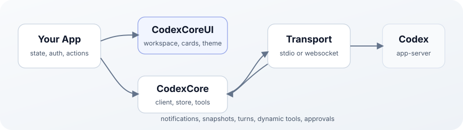

# CodexCore

Swift SDK, reusable SwiftUI app layer, and full native app for the Codex app-server stack.



## Products

| Product | What it is |
| --- | --- |
| `CodexCore` | Pure Swift SDK: client, transports, protocol types, store, projections, dynamic tools, and command sessions. |
| `CodexCoreUI` | Reusable SwiftUI app layer for using Codex as an intelligence layer inside a Swift app. |
| `codex-run` | Small executable for exercising the SDK. |
| `codex-core-app` | Full usable SwiftUI app demonstrating the modular Swift-native Codex stack. |

## Stack Vocabulary

- Codex app-server is the harness.
- CodexCore is the Swift SDK for Codex app-server.
- CodexCoreUI is the reusable app layer for using Codex as an intelligence layer in a Swift app.
- CodexCoreApp is a full usable app made to demonstrate the modular Swift-native Codex stack.

## Install

```swift
dependencies: [
    .package(url: "https://github.com/slopwareinc/codexcore.git", from: "0.2.0")
]
```

```swift
.target(
    name: "YourApp",
    dependencies: [
        .product(name: "CodexCore", package: "CodexCore"),
        .product(name: "CodexCoreUI", package: "CodexCore")
    ]
)
```

Use only `CodexCore` if you do not need SwiftUI.

## Quick Start

```swift
import CodexCore

let codex = try await Codex(config: CodexConfig(
    cwd: FileManager.default.currentDirectoryPath,
    approvalPolicy: .ask
))

let thread = try await codex.threadStart()
let result = try await thread.run("Summarize this project.")

print(result.finalResponse ?? "")
await codex.close()
```

## SwiftUI Workspace

```swift
import SwiftUI
import CodexCoreUI

CodexChatWorkspaceView(
    messages: messages,
    lifecycleEvents: lifecycleEvents,
    sideChat: sideChat,
    subagents: subagents,
    activities: activities,
    connectionState: .connected(server: "Codex"),
    workspacePath: workspacePath,
    draft: $draft,
    isSending: isSending,
    canSend: canSend,
    onSend: send,
    onInterrupt: interrupt,
    onDisconnect: disconnect
)
.codexAgentTheme(.officialDark)
```

Host apps that embed `CodexTranscriptView` can replace selected dynamic or MCP
tool-call cards with app-specific UI while leaving other tools on the generic
`CodexToolCallCard` path:

```swift
let toolCallRenderer = CodexTranscriptToolCallRenderer { toolCall in
    guard toolCall.displayName.hasPrefix("walkable.") else { return nil }
    return AnyView(WalkableResearchCard(toolCall: toolCall))
}

CodexTranscriptView(
    messages: messages,
    toolCallRenderer: toolCallRenderer
) {
    EmptyView()
}
```

Use `item/tool/requestUserInput` with the existing `CodexPrompt` flow for
blocking questionnaires. Use `CodexTranscriptToolCallRenderer` for non-blocking
rich progress cards such as research, project, or catalog updates.

## Run Locally

```bash
swift build
swift test
swift run codex-core-app
```

`CodexConfig` isolates auth, configuration, threads, and app-server state under
`CODEX_HOME=~/.codexcore` by default. Pass a `CodexHome` to use another isolated
home. The normal Codex app's `~/.codex` directory is never selected implicitly.
CodexCore also forces `cli_auth_credentials_store="file"`, keeping login tokens
inside that configured home instead of sharing the normal app's credential store.
Override `CODEX_BINARY`, `CODEX_BIN`, `CODEX_APP_BUNDLE`, or `codexBinaryPath`
when using a custom Codex runtime.

## Requirements

- Swift 6
- macOS 26+
- Codex runtime installed locally for live app use
