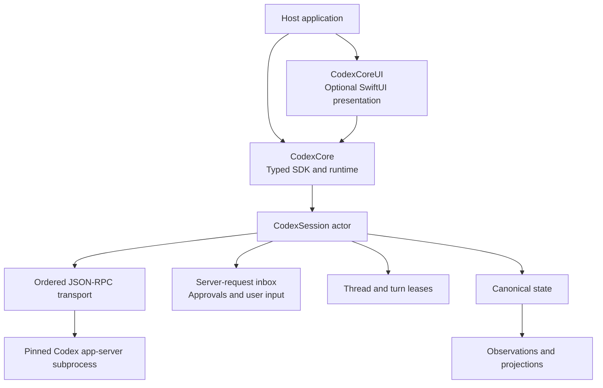

# CodexCore

Native Swift infrastructure for the Codex app-server: a Swift SDK, a reusable SwiftUI workspace, and a native macOS reference app.

> **Status:** CodexCore `0.10.0` targets macOS 26+, Swift 6.2, and `codex-cli 0.147.0` or newer. Protocol types are generated from stable `codex-cli 0.147.0`. CodexCore opts into experimental app-server capabilities.


## Built entirely with Codex

CodexCore was built end to end with **Codex, powered by GPT-5.6**. The human role was product direction and acceptance; Codex performed the repository analysis, architecture, implementation, testing, debugging, documentation, and release preparation.

Codex was used to:

- reverse-engineer and model the Codex app-server protocol as a typed Swift API;
- design and implement the SDK, reusable SwiftUI layer, and native macOS reference app;
- migrate the runtime across stable Codex CLI releases, generate and validate protocol types, and maintain concurrency invariants;
- run tests, delegate audits to subagents, package the app, capture product screenshots, and rebuild the documentation.

The result is also self-demonstrating: CodexCore hosts Codex workflows, while Codex itself is used to develop and verify CodexCore.

## Choose your layer

| You want to… | Use | Start here |
| --- | --- | --- |
| Run a native Codex client | `codex-core-app` | [Run the app](docs/getting-started/run-the-app.md) |
| Add a reusable Codex workspace to a SwiftUI app | `CodexCoreUI` + `CodexCore` | [Embed the UI](docs/ui/embedding.md) |
| Build your own UI or automation | `CodexCore` | [SDK quick start](docs/getting-started/sdk-quickstart.md) |
| Understand or contribute to the runtime | source package | [Contributor guide](CONTRIBUTING.md) |

`CodexCoreUI` is optional. The reference app is an example host, not a runtime dependency.

## What is included

| Product | Purpose |
| --- | --- |
| `CodexCore` | Process transport, typed app-server requests, thread/turn leases, canonical state, observation, approvals, dynamic tools, filesystem/process helpers, and protocol models. |
| `CodexCoreUI` | SwiftUI workspace, AppKit-backed transcript, composer, prompts, files, terminal, browser, diff previews, plugins, subagents, and theming. |
| `codex-core-app` | Native macOS reference application. See the [support matrix](docs/reference/support-status.md). |
| `codex-run` | Trusted development demo. It auto-approves operations and may write `todo.html` in its working directory. |

## Run the reference app

```bash
git clone https://github.com/slopwareinc/codexcore.git
cd codexcore
codex --version       # checks only the PATH candidate; it must print codex-cli 0.147.0 or newer
swift run --jobs 4 codex-core-app
```

For a normal Finder/Dock application with bundle metadata and the CodexCore icon:

```bash
./scripts/package-app.sh --release
open build/CodexCore.app
```

The packager uses hardened-runtime signing and an installed Developer ID or
Apple Development identity when available, preserving macOS privacy grants
across local rebuilds. It falls back to ad-hoc signing when no identity exists.
Developer ID notarization and signed Sparkle appcast generation are opt-in;
see the [packaging and release guide](docs/getting-started/run-the-app.md#updates-notarization-and-appcasts).

On first launch, sign in with ChatGPT or an API key, choose a workspace, and start a task. CodexCore stores credentials and configuration in `~/.codexcore`; it does not reuse `~/.codex` implicitly.

See [requirements](docs/getting-started/requirements.md) and [authentication](docs/getting-started/authentication.md) before troubleshooting runtime or sign-in failures.

## Install the libraries

```swift
dependencies: [
    .package(
        url: "https://github.com/slopwareinc/codexcore.git",
        exact: "0.147.0+codexcore.0.10.0"
    )
]
```

```swift
.target(
    name: "YourApp",
    dependencies: [
        .product(name: "CodexCore", package: "codexcore"),
        .product(name: "CodexCoreUI", package: "codexcore") // optional
    ]
)
```

## Minimal SDK session

```swift
import CodexCore
import Foundation

let cwd = FileManager.default.currentDirectoryPath
let codex = try await Codex(config: .init(cwd: cwd))
defer { Task { await codex.close() } }

let thread = try await codex.startThread(.init(cwd: cwd))
defer { Task { await thread.close() } }

let input = CodexSchemaUserInput(.dictionary([
    "type": .string("text"),
    "text": .string("Summarize this project in three bullets."),
]))

let result = try await thread.runTurn(.init(
    input: [input],
    threadID: thread.id.rawValue
))

for item in result.items where item.kind == .agentMessage {
    if let text = CodexJSONCoercion.string(from: item.payload["text"]) {
        print(text)
    }
}
```

This minimal example can wait when app-server asks for approval or input. Production hosts must present or resolve every supported server-request family; see [approvals and input](docs/sdk/approvals-and-input.md).

## Architecture



Read the [architecture overview](docs/architecture/overview.md) for invariants and ownership boundaries.

## Documentation

- [Documentation index](docs/index.md)
- [App guide](docs/app/using-the-app.md)
- [SDK lifecycle](docs/sdk/threads-and-turns.md)
- [Embedding CodexCoreUI](docs/ui/embedding.md)
- [Configuration reference](docs/reference/configuration.md)
- [Support status](docs/reference/support-status.md)
- [Troubleshooting](docs/getting-started/troubleshooting.md)
- [Contributing](CONTRIBUTING.md)

## Development

```bash
swift build --jobs 4 --target CodexCoreApp
swift test --jobs 4
python3 -m unittest discover Tools/tests
```

Protocol bindings are generated. Do not edit `Sources/CodexCore/Generated/` or generated request factories by hand; follow [protocol upgrades](docs/contributing/protocol-upgrades.md).

## License and support

CodexCore is available under the [MIT License](LICENSE).

Use [GitHub Issues](https://github.com/slopwareinc/codexcore/issues) for reproducible bugs and focused feature requests. Do not post credentials or sensitive app-server logs publicly.
