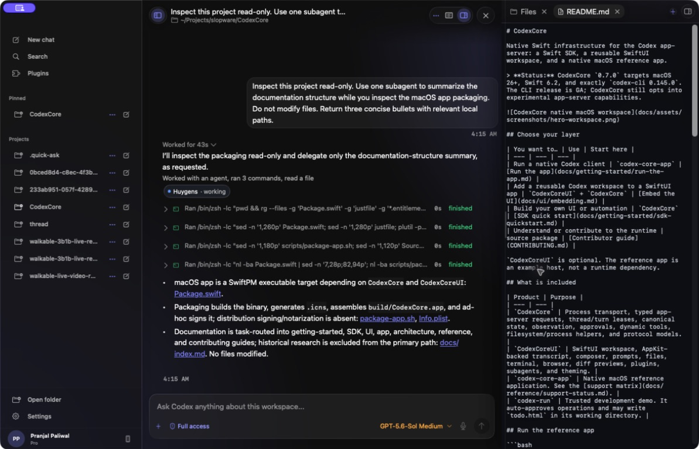
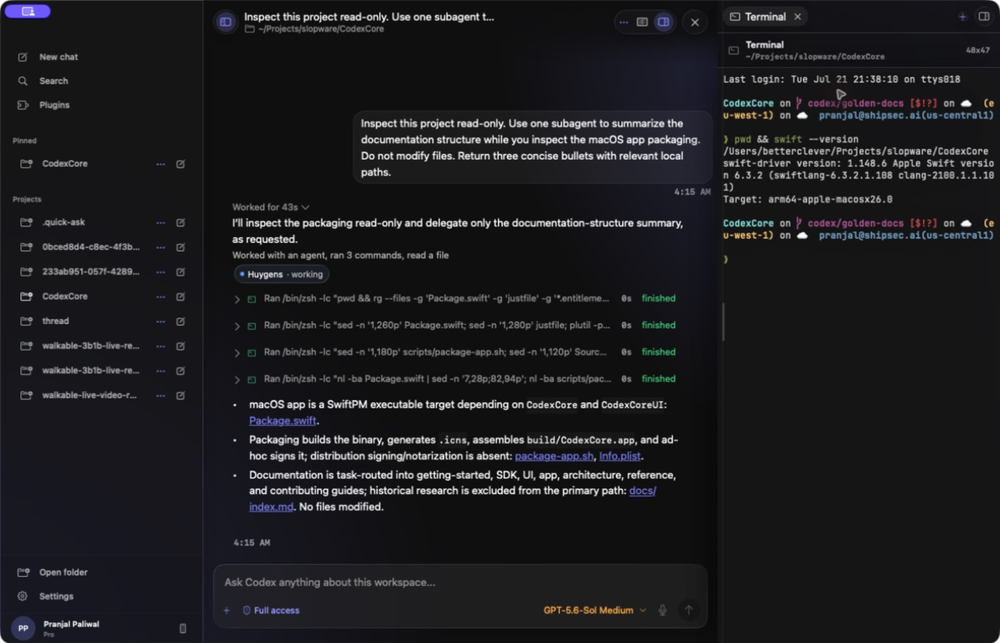
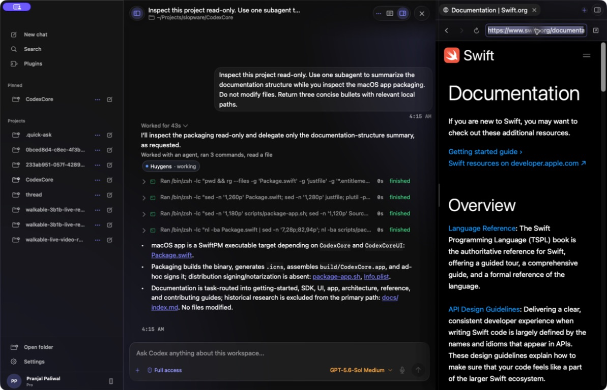

# Tools, diff previews, and worktrees

## Workspace tools

The app can present:

- syntax-highlighted file previews;
- command output and interactive terminal sessions;
- a manual embedded WKWebView browser (not agent browser-tool integration);
- turn diff previews and file-change summaries;
- environment and workspace context;
- subagent activity and side chat.

These surfaces visualize app-server or host state. They do not expand filesystem or network authority by themselves.

### Files

Open **Files** to browse the active workspace and preview text files without leaving the task.

### Terminal

Open **Terminal** for a real interactive shell rooted in the workspace. Terminal commands use the permissions of the host process; opening the panel does not grant an agent permission to run them.

### Browser

Open **Browser** for manually navigated documentation and local previews. It is an embedded WKWebView for the user, not an agent-controlled browser tool.

## Experimental diff preview

When the current turn emits a parseable unified diff, the workspace can expose a Review tab with changed-file counts and a file summary. This is a conditional preview, not a repository-wide Git review workflow.

Branch selection, review options, commit, push, and pull-request controls are intentionally unwired in the current reference app. Treat the working tree and normal Git tooling as authoritative.

The reference app omits worktree handoff, Git mutation controls, and the old demo bottom terminal. Use external Git tooling for worktrees and the workspace side panel for the real interactive Ghostty terminal.
