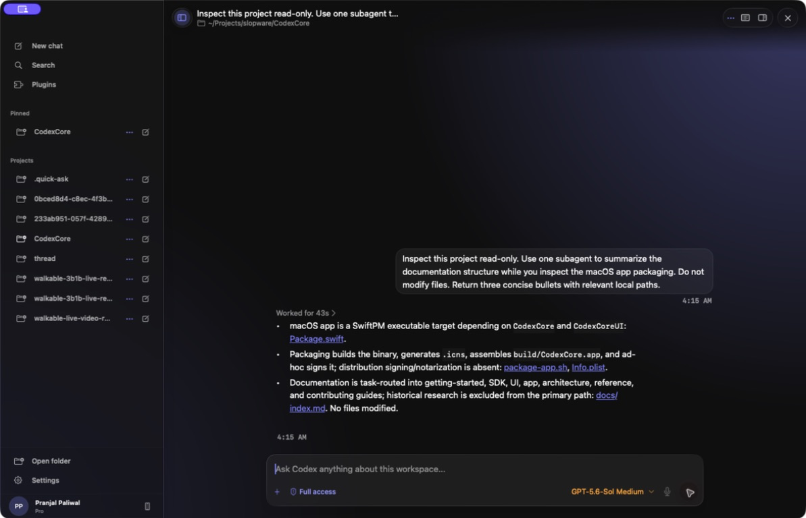
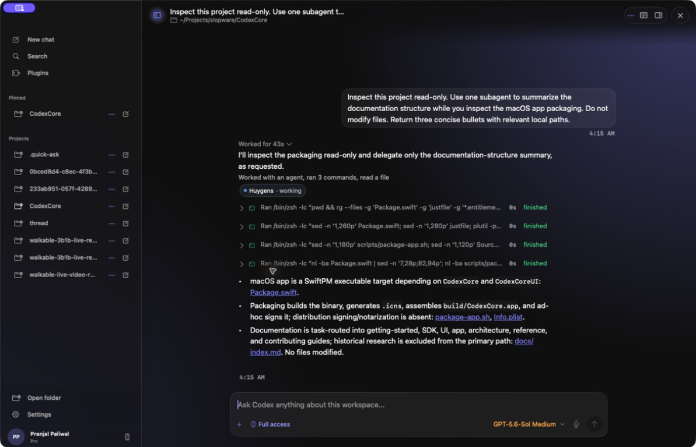

# Use the reference app

The reference app is a native Codex host and living integration example. The [support matrix](../reference/support-status.md) distinguishes working flows from preview-only surfaces.

## Main routes

- **Chat:** project threads, transcript, composer, approvals, plans, and tools.
- **Search:** find and resume existing chats.
- **Plugins:** inspect plugins, skills, and MCP-backed capabilities.
- **Settings:** appearance, history, sidebar, integrations, and application information.

## Projects and chats

The sidebar groups chats by project. Chats can be pinned, archived, renamed, forked, copied, searched, and resumed. Projects can be selected, grouped, pinned, reordered, edited, removed, revealed in Finder, or used to archive their chats. Chat reorder/hide/reveal actions are not supported.

A separate **Chats** section contains projectless tasks. **New chat** creates a
projectless task in a generated `Documents/Codex/Chats` workspace; use a
project's new-chat action when the task should inherit that project's folders.
Projectless identity is persisted separately from `cwd`, so generated workspaces
do not appear as projects.

Unread state is local app state, not app-server protocol state. A chat becomes
unread only when the running app receives a completed assistant message for
that chat while its conversation is not visible in the focused main window.
History loading, streaming deltas, tool activity, status changes, failures, and
metadata refreshes do not create unread state. Opening the chat in the focused
conversation view marks it read.

The sidebar reserves one trailing state rail per chat: active work takes
precedence over failure, which takes precedence over unread. Project and section
rows summarize that state while collapsed. Selecting a project or one of its
chats expands the project automatically; pin and archive controls appear only
while the row is hovered.

A project may contain multiple ordered source folders. The first folder is
**Primary**: Codex uses it as `cwd` and looks there for project instructions.
Every source folder is sent as a runtime workspace root and is available to the
task. Choose **Edit project** from the project menu to add or remove folders or
make another folder Primary. Existing single-folder projects migrate without
configuration.

The workspace overview mirrors the current environment with changes, local or
worktree mode, branch, commit/push, and pull-request entries. Its Sources
section shows the most recent file references from the visible transcript and
the current composer.

## Composer

The composer supports:

- model and reasoning selection;
- permission and approval profiles;
- click or hold microphone dictation, with insert, transcribe-and-send, and retry actions;
- Goal and Plan modes;
- file/folder attachments and mentions;
- slash commands;
- queued follow-ups, explicit steering, and turn interruption.

While a turn is running, each send adds another follow-up card above the composer. Choose **Steer** to inject that exact message into the active turn, edit or remove it from the card, or leave the FIFO queue alone. A steered message becomes a new user bubble inside the active turn; it never edits or replaces the turn's original prompt. CodexCore starts exactly one queued message when the current turn completes; any remaining messages wait for each new turn to complete in order.

Steer actions are serialized. If the active turn ends at the same moment you choose **Steer**, the app starts the message as the next turn immediately; it does not leave the message stuck waiting for another completion event.

Start with the least privilege that can complete the task. Review commands, requested permissions, and proposed file changes before approval; inspect resulting files afterward.

## Voice chat

When the composer is empty, choose the waveform button in the send-button
position to start Voice. The microphone beside it remains the separate dictation
control. From a projectless Home draft, Voice creates a dedicated top-level
projectless task with `threadSource: realtime_voice`. Ordinary text and project
tasks do not expose the waveform. Reopen an existing Voice task to start another
Voice session on that task.
The task uses app-server's thread-scoped realtime V3 session, streams microphone
audio and model audio, and shows a live transcript with an animated orb instead
of the text composer. The active controls independently mute the microphone or
speaker and end the call. Only one Voice task can be active at a time.

Voice remains active when you inspect another task; use the floating Voice
control to return or end the call. Because Voice is an ordinary Codex thread
with startup context, it can use tools and create subagents. Desktop tasks also
receive the `codex_app` orchestration tools used by the official app: they can
list projects and tasks, create a new top-level project or projectless task,
read a task, or send it a follow-up without moving the visible selection.
Realtime utterances and canonical delegated work share one arrival-ordered
transcript. Tool activity stays at the point where Voice delegated it and keeps
the normal expandable **Worked for …** disclosure.

## Transcript

The transcript groups user input, agent work, tool calls, subagents, approvals, plans, diffs, and final answers into canonical turns. Expanded heavy details are materialized on demand.

Subagents appear inside the parent turn. Select a subagent chip to inspect its focused transcript without losing the parent task.
