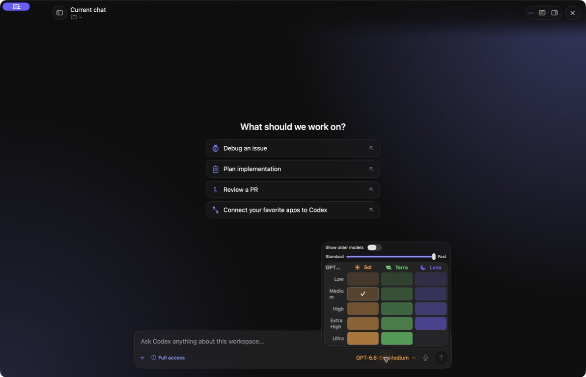

# Run the reference app

The reference app demonstrates the SDK and reusable UI. It is not required by library consumers, and some visible routes are previews rather than wired workflows; see [support status](../reference/support-status.md).



## Build and launch

```bash
git clone https://github.com/slopwareinc/codexcore.git
cd codexcore
codex --version  # verifies only the PATH candidate
swift build --jobs 4 --target CodexCoreApp
swift run --skip-build codex-core-app
```

With `just` installed:

```bash
just run
```

`just run` stops an existing development instance, rebuilds, and launches the app.

## Build a macOS application bundle

`swift run` launches an unbundled development executable. To produce a registered Finder/Dock app with `Info.plist`, icon, and hardened-runtime signature:

```bash
./scripts/package-app.sh --release
open build/CodexCore.app
```

Or run `just run-app` for a debug bundle. Output is `build/CodexCore.app` plus a versioned zip archive in `build/`. The packager derives `CFBundleVersion` from the Git commit count and embeds the full commit SHA in `CodexCoreGitCommit`; set `CODEXCORE_BUILD_NUMBER` to a valid numeric Core Foundation version when a release system supplies its own monotonically increasing build number.

The packager automatically uses an installed Developer ID or Apple Development
identity so macOS privacy grants survive rebuilds. Set
`CODEXCORE_SIGNING_IDENTITY` to choose a specific Keychain identity, or set it
to `-` to force ad-hoc signing. If no identity is available, the script falls
back to ad-hoc signing and warns that microphone permission may reset after
each rebuild. Sharing the app still requires Developer ID signing and Apple
notarization.

CodexCore is intentionally not App Sandbox-enabled because Codex workflows launch the selected Codex runtime and arbitrary user-approved subprocesses. Its hardened-runtime entitlements are limited to microphone input, speech recognition, and outbound network access.

## Notarization

Notarization is opt-in. Store Apple credentials in a Keychain profile once, then pass only the profile name to the packager:

```bash
xcrun notarytool store-credentials codexcore-notary \
  --apple-id maintainer@example.com \
  --team-id TEAMID1234 \
  --password 'app-specific-password'

CODEXCORE_SIGNING_IDENTITY='Developer ID Application: Example (TEAMID1234)' \
CODEXCORE_NOTARY_KEYCHAIN_PROFILE=codexcore-notary \
./scripts/package-app.sh --release
```

When the profile variable is present, the script submits the zip with `notarytool`, waits for acceptance, staples and validates the app, then recreates the zip with the stapled bundle. Without it, notarization is skipped cleanly. CodexCore has no embedded updater; distribution and upgrades are handled outside the application.

## First session

1. Authenticate with ChatGPT device login or an API key.
2. Open a workspace folder.
3. Start a new chat within that project.
4. Choose the model and permission mode.
5. Submit a small, verifiable task.
6. Review each approval before allowing an operation, then inspect resulting files and any available diff preview.

The app stores its state under `~/.codexcore`. Existing Codex Desktop or CLI authentication under `~/.codex` is intentionally not reused.

## Development commands

```bash
just build       # build the app target
just run-fast    # relaunch without an explicit build step
just kill        # stop development instances
just trace       # record a performance trace for a running app
```

`just trace` requires Xcode Instruments tooling and at least 10 GiB of free disk space. Set `TRACE_DURATION=30s` to override its default duration.

Do not use `swift run codex-run` as a harmless smoke test: that target auto-approves operations and asks Codex to create `todo.html` in the current directory.
