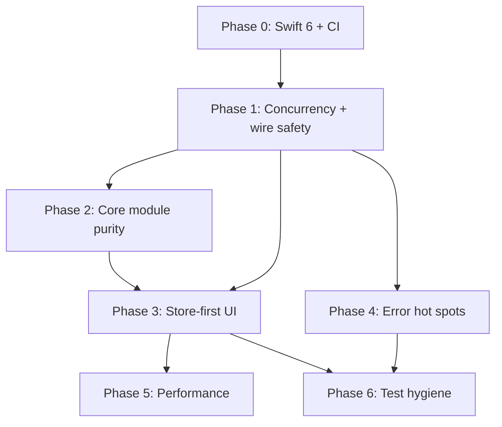

# CodexCore Hardening Plan

This plan addresses the major Swift best-practice gaps identified in the June 2026 audit. It is scoped to **high-impact fixes** that **replace** incorrect patterns with the correct modern approach — not add parallel APIs, compatibility shims, or legacy fallbacks.

It builds on the direction in [`ui-state-consolidation.md`](ui-state-consolidation.md): **`CodexCoreStore` is the single source of truth**; UI layers project from store snapshots instead of re-parsing wire notifications or polling.

---

## Principles

1. **Replace, don't accumulate.** When we fix polling, we delete the poll loop. When we fix `@unchecked Sendable`, we change the type — we don't add a wrapper beside it.
2. **Shrink surface area.** Prefer moving logic into existing owners (`CodexClient`, `CodexCoreStore`, `CodexTimelineItemMapper`) over new protocols, facades, or modules.
3. **One path per concern.** Store reduction → snapshot → projection. No second raw-notification parser when the store already has the answer.
4. **Swift 6 by default.** Enable language mode and fix what the compiler surfaces; don't suppress with `@unchecked Sendable` unless documented and unavoidable.
5. **Delete dead code in the same PR** as each replacement. A fix isn't done until the old path is gone.

---

## Out of scope (for this plan)

These are real issues but would expand API surface or touch too many files for little gain right now:

| Item | Why deferred |
|------|----------------|
| New `CodexClient` / `CodexService` protocols | Large API churn; tests already use `MockTransport` |
| `threadId` → `threadID` rename pass | Cosmetic; touches generated + hand-written boundaries |
| Splitting every god file (`Client.swift`, `ChatModel.swift`, etc.) | Organizational; not blocking correctness |
| Full accessibility / `#Preview` sweep | Important for product quality, separate UX track |
| Swift Testing migration | XCTest works; migration is additive churn |
| `CodexChatRuntimeSession` ↔ `CodexChatRuntimeState` merge | Pass-through is wasteful but not unsafe |
| `@Observable` store split into Foundation reducer + UI wrapper | Would add new public types; store stays `@MainActor` for now |
| DocC, SwiftFormat, broad SwiftLint rule packs | Tooling track after CI exists |

---

## Phase 0 — Baseline (1 PR)

**Goal:** Turn on Swift 6 checking so later fixes are compiler-guided, not guesswork.

### Changes

- Add to `Package.swift`:
  - `swiftLanguageVersions: [.v6]`
  - Per-target `swiftSettings: [.swiftLanguageMode(.v6)]` on `CodexCore` first, then `CodexCoreUI`, then tests/example
- Add minimal CI (`.github/workflows/ci.yml`):
  - `swift build`
  - `swift test` with filters excluding live probes by default
  - `Tools/check_drift.sh` (skip gracefully if `codex` binary absent)
- Standardize live test gating:
  - **Replace** silent `return` in `CodexClientLiveAppServerTests` with `throw XCTSkip(...)`
  - Live probes require explicit env vars (`CODEX_REAL_SUBAGENT_PROBE=1`, etc.)

### Done when

- Package builds under Swift 6 language mode
- CI runs on every PR
- No silent-pass live tests

---

## Phase 1 — Concurrency & wire safety (2–3 PRs)

**Goal:** Eliminate data races, hung RPCs, and unstructured task sprawl in the SDK layer. No new public types.

### 1a. `CodexCommandExecSession` → actor-owned state

**Problem:** Mutable session state (`hasCompleted`, `result`, continuations) is `@unchecked Sendable` and mutated from `CodexClient` and caller tasks concurrently.

**Replace with:** Session lifecycle fully owned by `CodexClient` actor. `CodexCommandExecSession` becomes a thin handle exposing streams + async methods that always hop through the client actor (or becomes an `actor` itself with no `@unchecked Sendable`).

**Delete:** `@unchecked Sendable` on `CodexCommandExecSession`, unsynchronized field mutation.

**Files:** `CommandExecSession.swift`, `Client.swift`, `CodexTerminalView.swift` (after Phase 2 move).

### 1b. Serial notification handling

**Problem:** `connect(onNotification:)` spawns unbounded `Task { await handleNotification }` per frame — reordering, no backpressure, no cancellation on disconnect.

**Replace with:** `onNotification` callback that **directly awaits** `handleNotification` on the connection's delivery path, or a single long-lived consumer task inside `CodexClient` that processes an internal async channel serially.

**Delete:** Per-notification unstructured `Task {}` in `Client.swift:81–83`.

### 1c. Awaited registration cleanup

**Problem:** `defer { Task { await unregisterTurn } }` never awaits cleanup.

**Replace with:** `defer { await notificationRouter.unregisterTurn(turnId) }` inside actor methods (legal in Swift 6 actor context).

**Delete:** Fire-and-forget defer tasks for turn/login registration.

### 1d. Connection decode failures must fail pending RPCs

**Problem:** When a JSON-RPC response fails to decode, `pendingRequests` continuations are never resumed → hung `await request(...)`.

**Replace with:** On decode failure, extract `id` from raw payload if possible and `continuation.resume(throwing: CodexConnectionError.decodeFailed(...))`. Reuse existing `failPendingRequests` on disconnect.

**Delete:** Print-and-return paths that leave continuations hanging (`Connection.swift:250–252, 303–305`).

### 1e. Transport & example retain cycles

**Replace with:**
- `ChatModel.swift` server handler: `[weak self]` capture
- `Transport.swift` stdio `readabilityHandler`: `[weak self]` (match WebSocket path)

**Delete:** Strong capture cycles that prevent teardown.

### 1f. `@MainActor` deinit → explicit lifecycle

**Problem:** `CodexChatStreamSession`, `CodexPromptEventSession`, `CodexMentionSearchSession` cancel tasks in `deinit` (nonisolated in Swift 6).

**Replace with:** `cancelAll()` / `reset()` called by owning session (`CodexChatRuntimeSession`, `CodexPromptRuntimeSession`) before release. Owners already exist — wire them.

**Delete:** Task cancellation in `deinit`.

### 1g. Remaining `@unchecked Sendable` audit

**Replace with proper isolation (pick one per type, no dual paths):**

| Type | Replacement |
|------|-------------|
| `CodexIncomingMessageSequencer` | `actor` or `OSAllocatedUnfairLock`-protected buffer |
| `LineBuffer` (Transport) | Keep inside transport actor; remove `@unchecked Sendable` |
| `Codex` / handles (`CodexThread`, `CodexTurnHandle`, login handles) | Remove `@unchecked Sendable`; mark UI-bound accessors `@MainActor` or route through actor |
| `CodexTurnHandle.run()` | Check `Task.isCancelled`; **replace** wall-clock-only loop |

**Delete:** All `@unchecked Sendable` that Phase 1 touches. Document any that truly remain.

### Done when

- Thread Sanitizer / Swift 6 concurrency checks clean on client + transport paths
- No hung RPC tests
- `swift test --filter CodexCoreTests` passes

---

## Phase 2 — Core module purity (1–2 PRs)

**Goal:** `CodexCore` is headless (Foundation + Observation only where the store requires it). No SwiftUI in the SDK target.

### 2a. Split `ANSIParser` — parsing vs presentation

**Replace with:**
- `CodexCore`: `ANSIParser` produces semantic segments (SGR attributes as integers/enums, plain `String` text). No `import SwiftUI`.
- `CodexCoreUI`: `ANSITerminalStyle` maps semantic attributes → `Color`; attributed-string helper stays here.

**Delete:** `Color` in `ANSIStyle` (`ANSIParser.swift`), SwiftUI import from core parser.

### 2b. Move `CodexTerminalView` to `CodexCoreUI`

**Replace with:** View lives next to other transcript/terminal UI. Core keeps `CodexCommandExecSession` API only.

**Delete:** SwiftUI view from `Sources/CodexCore/Parser/`.

### 2c. Mark `Codex.store` as `@MainActor`

**Problem:** `@unchecked Sendable Codex` exposes `@MainActor @Observable` store without enforcement.

**Replace with:** `@MainActor public var store: CodexCoreStore` on `Codex` (and adjust call sites — compiler will guide). No second store accessor.

**Delete:** `@unchecked Sendable` on `Codex` once store access is correctly isolated.

### Done when

- `CodexCore` target does not `import SwiftUI`
- `codex-run` and core tests build without SwiftUI
- Example app still renders terminal via `CodexCoreUI`

---

## Phase 3 — Store-first UI; delete polling & duplicate parsing (2–3 PRs)

**Goal:** Align with [`ui-state-consolidation.md`](ui-state-consolidation.md) next slice. UI reads store; no 200ms poll loops; fewer raw-notification switches.

### 3a. Replace approval-store polling with `@Observable` store reads

**Problem:** `CodexPromptEventSession.startApprovalStoreMirror` polls `codex.store.pendingApprovals` every 200ms.

**Replace with:** Example + `CodexPromptStateSession` react to `codex.store` changes directly. With `@Observable`, SwiftUI views and `@MainActor` session methods already re-run when `pendingApprovals` / `pendingUserInput` mutate (store updates happen in `CodexClient` → `store.dispatchRequest`).

**Delete:**
- `startApprovalStoreMirror` / `startApprovalSnapshotMirror` and their poll loops
- `approvalEventTask` and interval parameter
- Tests that assert polling behavior (`CodexPromptStateSessionTests` — rewrite to assert store-driven sync)

**Files:** `CodexPromptEventSession.swift`, `CodexPromptRuntimeSession.swift`, `ChatModel.swift`, tests.

### 3b. Replace turn polling with notification/stream waits

**Problem:** `CodexTurnHandle.run()` and `snapshots()` poll every 200ms.

**Replace with:**
- `run()` → `waitForTurnCompleted`-style consumption of turn notification stream (already exists on client)
- `snapshots()` → `AsyncStream` driven by turn notifications, not sleep loops

**Delete:** Sleep-based polling loops in `Codex.swift`.

### 3c. Fix store streaming delta performance

**Problem:** `appendDelta` uses `currentText + delta` (quadratic copies).

**Replace with:** In-place `streamingBuffers[itemId, default: ""].append(delta)` (or mutate then assign once).

**Delete:** String concatenation per delta.

### 3d. Narrow live notification routers to no-snapshot fallbacks only

**Problem:** `CodexChatTranscriptNotificationRouter` and `CodexAgentNotificationRouter` still contain primary raw-delta paths even when store snapshots exist (documented as "remaining smells" in consolidation doc).

**Replace with:** Router logic becomes:
1. Ask store for `(threadID, turnID)` snapshot
2. If snapshot has the item → project via `CodexChatTranscriptProjection` (already store-backed)
3. **Only if** snapshot missing → raw fallback (keep one fallback path, not two equal paths)

**Delete:** Redundant raw-delta branches that duplicate store projection when snapshot is present. Prune as compiler/tests prove unreachable.

### 3e. `CodexInteractivePromptBridge.events()` lifecycle

**Replace with:** `continuation.onTermination` clears `eventContinuation`; second `events()` call finishes previous continuation.

**Delete:** Orphaned continuations.

### Done when

- No `Task.sleep` poll loops in production UI sessions for approvals or turns
- Transcript routers prefer store projection in tests covering live deltas
- `CodexPromptEventSession` only owns interactive-prompt **event stream** tasks, not store mirroring

---

## Phase 4 — Error handling & correctness hot spots (1 PR)

**Goal:** Fail loudly and consistently at boundaries. Small, surgical diffs.

| Current | Replace with | Delete |
|---------|--------------|--------|
| Force unwrap `threadSnapshotsByID[threadID]!` | `guard var thread = ... else { continue }` | Crash path |
| Force unwrap after optional check (`language!`, `cleanError!`) | `if let x, !x.isEmpty { x } else { default }` | `!` |
| Raw `JSONRPCError` thrown from `Client` | `CodexSDKError.invalidResponse` | Dual error type at boundary |
| `try?` on reconnect handshake | `do/catch` → surface connection state / rethrow | Silent half-dead reconnect |
| WebSocket send UTF-8 failure → `return` | `throw CodexTransportError.writeFailed` | Silent send drop |
| `try!` regex in parsers | `Regex` (Swift 5.7+) or static `let` with `throws` factory | `try!` |
| `CommandExecSession.write` throws `connectionClosed` when completed | New case e.g. `CodexSDKError.sessionCompleted` | Wrong error semantics |

Add `LocalizedError` to public error enums (`CodexSDKError`, `CodexRPCError`, `CodexConnectionError`, `CodexTransportError`) and use `errorDescription` in example error formatting.

**Do not** introduce `Result<>` alongside `throws` — standardize on `async throws` in SDK, `Bool` + `errorMessage` closure in UI sessions (existing pattern).

---

## Phase 5 — Performance fixes tied to above work (1 PR, can overlap Phase 3)

Only fixes that **fall out of** store-first and parser moves — no speculative optimization.

| Fix | When |
|-----|------|
| Incremental ANSI parse (append to parser state, don't reparse 30k chars) | Phase 2 terminal move |
| `ANSISegment` stable identity (hash of text+style, not `UUID()`) | Phase 2 |
| Reuse one `AssistantRenderBlockParser` on `MessageParser` instance | Phase 4 parser cleanup |
| Remove redundant `MainActor.run` inside `@MainActor` session tasks | Phase 3 polling removal |
| `CodexTranscriptView`: throttle scroll-on-stream (`onChange` of turn completion or batched text) | Phase 3 |
| Side panel `LazyVStack` | Trivial one-liner in same PR as transcript perf |

---

## Phase 6 — Test hygiene (1 PR)

**Goal:** Tests match production patterns; no flakes from sleeps.

- **Replace** `Task.sleep` synchronization with `XCTestExpectation` or awaiting first stream value (target the ~30 worst call sites in client tests first)
- **Replace** `defer { Task { await codex.close() } }` with `await codex.close()` before test exit
- Extract shared `makeConnectedClient() -> (CodexClient, MockTransport, CodexCoreStore)` helper — **one** factory, not a new module
- **Replace** extension-attached test classes with dedicated test classes when touching those files
- Add targeted tests for Phase 1 fixes:
  - Connection decode failure resumes pending request
  - Command exec session concurrent write/complete
  - Reconnection manager cancellation on disconnect (if fixed in Phase 1)

**Do not** rewrite the entire suite in Swift Testing.

---

## Execution order & dependencies

Phases 2 and 3 can partially overlap once Phase 1 lands (terminal view move depends on command session actor fix).

---

## PR checklist (every phase)

- [ ] Old code path deleted, not deprecated
- [ ] No new public protocols/types unless absolutely required
- [ ] `swift build` + `swift test` pass under Swift 6 mode
- [ ] No new `@unchecked Sendable` without written justification in PR description
- [ ] No new poll loops (`Task.sleep` for state sync)
- [ ] Consolidation doc updated if store ownership shifts (`docs/ui-state-consolidation.md`)

---

## Success metrics

| Metric | Before | Target |
|--------|--------|--------|
| `@unchecked Sendable` in Sources | 9 | 0 (or documented exceptions) |
| `Task.sleep` poll loops in UI sessions | 3+ | 0 |
| SwiftUI imports in `CodexCore` | 2 files | 0 |
| Hung RPC on malformed response | Possible | Impossible (test-covered) |
| Silent-pass live tests | 1 | 0 |
| CI | None | Required on PR |

---

## Future track (after this plan)

These align with [`ui-state-consolidation.md`](ui-state-consolidation.md) "Next slice" but are **separate** from hardening:

1. **Child-agent graph in Core** — parent subagent notifications update `CodexThreadSnapshot.childThreads`; UI projects panels from store graph instead of mutating `CodexAgentStateMapper` on raw child notifications.
2. **Thread item type constants** — internal `ThreadItemType` enum generated or shared from mapper; deletes string duplication across mappers (touches many files; do after graph work).
3. **`CodexServerItem` Codable fix** — fix keyed+singleValue decode bug when touching protocol layer.
4. **Accessibility + previews** — product-quality pass on `CodexCoreUI` components.

---

## Estimated effort

| Phase | PRs | Relative effort |
|-------|-----|-----------------|
| 0 | 1 | Small |
| 1 | 2–3 | Large (highest risk) |
| 2 | 1–2 | Medium |
| 3 | 2–3 | Large (most deletions) |
| 4 | 1 | Small |
| 5 | 1 | Small (mostly bundled) |
| 6 | 1 | Medium |

**Total:** ~9–12 PRs. Phases 0–4 are the **must-do** hardening track. Phases 5–6 polish and can trail slightly.
