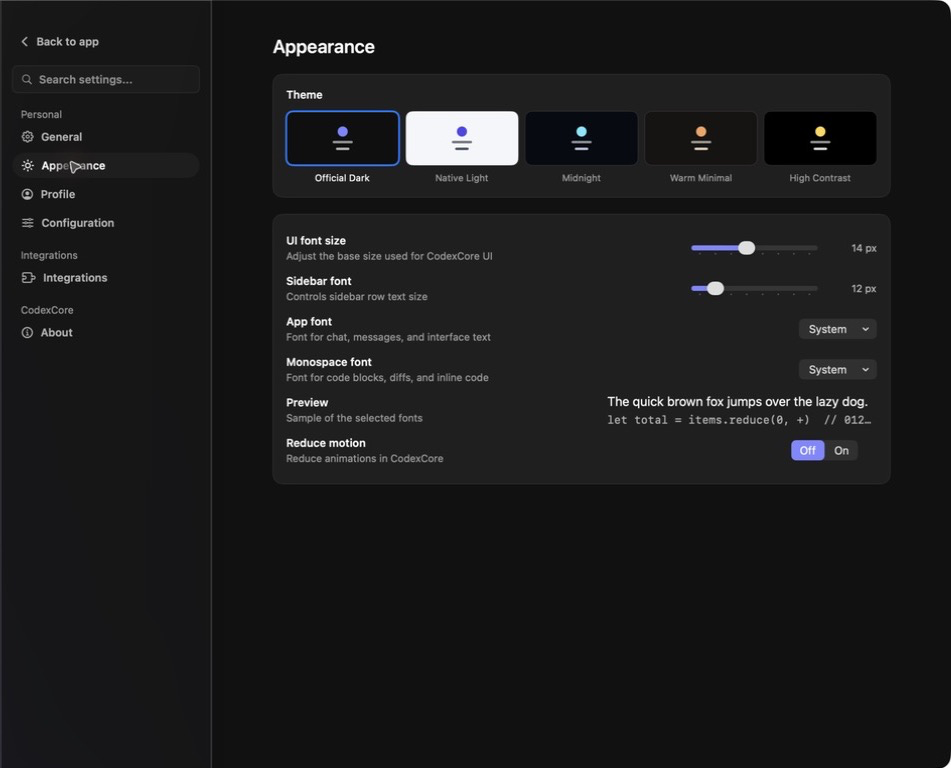

# Theming and host boundaries

Apply a theme at the embedding boundary:

```swift
RootView()
    .codexAgentTheme(.officialDark)
```

The reference app demonstrates appearance settings and responsive panel behavior. A host may provide its own navigation and chrome while reusing the transcript and composer.



## Host-owned responsibilities

- connection and authentication lifecycle
- workspace selection and filesystem scope
- approval and permission policy
- model and reasoning preferences
- persistent drafts and navigation
- opening URLs, files, terminals, and external applications
- product-specific tool rendering

## CodexCoreUI-owned responsibilities

- reusable visual components
- canonical transcript projection and rendering
- prompt, plan, diff, subagent, and activity presentation
- responsive workspace layout
- accessibility labels for provided controls

Avoid making reusable views read global application singletons. Pass capabilities and actions explicitly.
