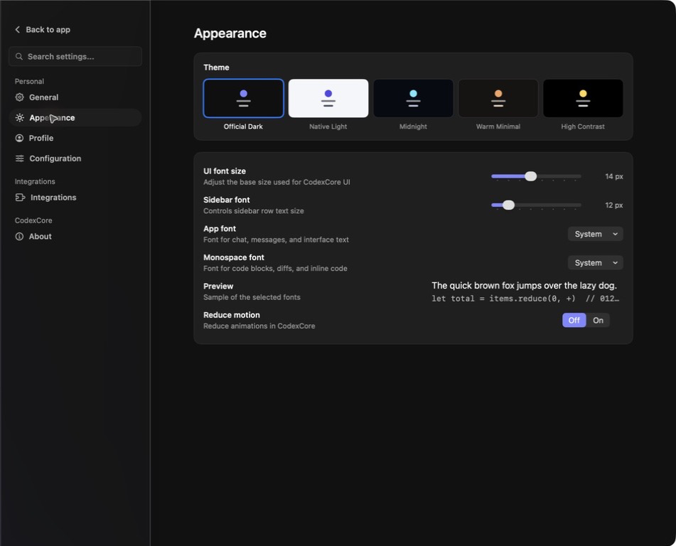

# Theming and host boundaries

Apply a theme at the embedding boundary:

```swift
RootView()
    .codexAgentTheme(.t3Code)
```

The reference app demonstrates appearance settings and responsive panel behavior. A host may provide its own navigation and chrome while reusing the transcript and composer.

The reference app's default presentation ports T3 Code's neutral styling and
compact interaction conventions. See [T3 Code presentation](t3-code-presentation.md)
for the pinned upstream sources and embedding hooks. Saved theme choices remain
available, including generated hue families with Liquid Glass.

The reference app also derives its running Dock icon from the active theme. The
petal geometry remains fixed while the theme family supplies its tint; changing
the theme or system appearance updates the Dock and app-switcher icon without
mutating the signed bundle icon shown by Finder.



## Host-owned responsibilities

- connection and authentication lifecycle
- workspace selection and filesystem scope
- approval and permission policy
- model and reasoning preferences
- persistent drafts and navigation
- opening URLs, files, terminals, and external applications
- product-specific tool rendering

## CodexCoreUI-owned responsibilities

- reusable visual components
- canonical transcript projection and rendering
- prompt, plan, diff, subagent, and activity presentation
- responsive workspace layout
- accessibility labels for provided controls

Avoid making reusable views read global application singletons. Pass capabilities and actions explicitly.
